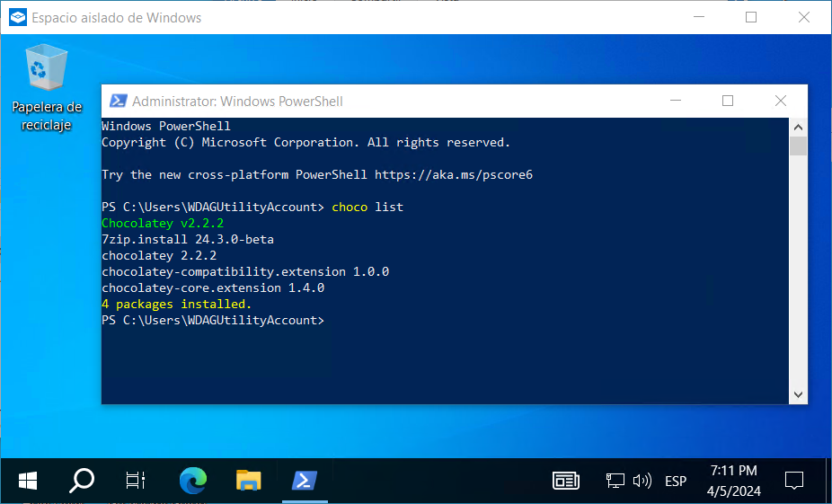

# Windows Sandbox Choco

### With oneline.wsb, you can install Chocolatey package manager and 7-Zip (as an example) into Windows Sandbox without the need for scripts:

### But if you need scripts, you can simply use script.ps1:

https://github.com/.../script.ps1#L1-L8 

### which essentially performs the same actions as the single command in oneline.wsb.
### You only have to specify the location of the repo on your disc in script.wsb:

https://github.com/.../script.wsb#L6